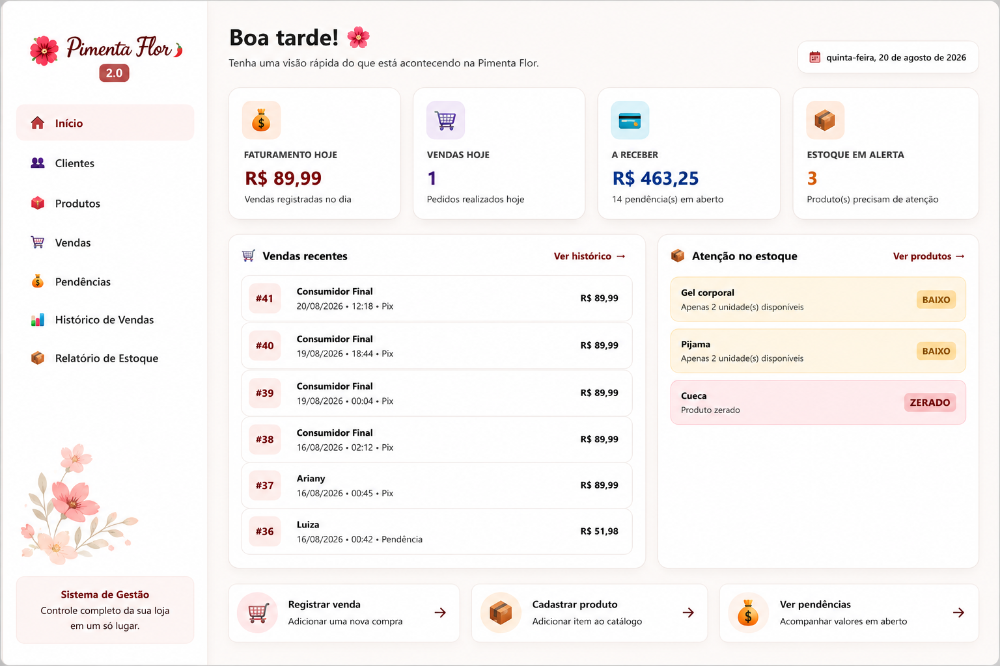
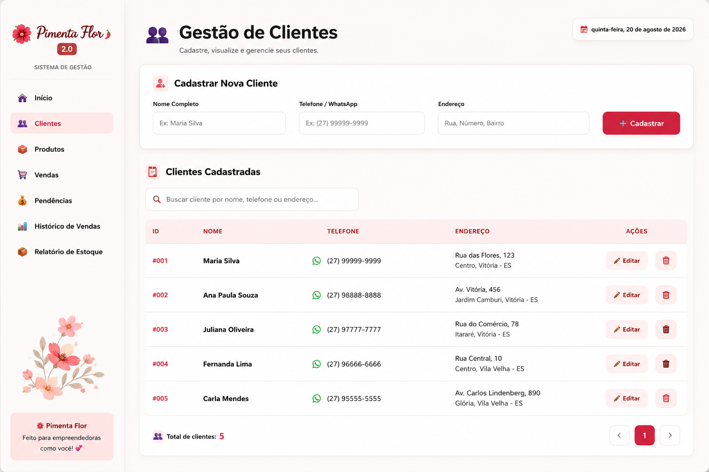
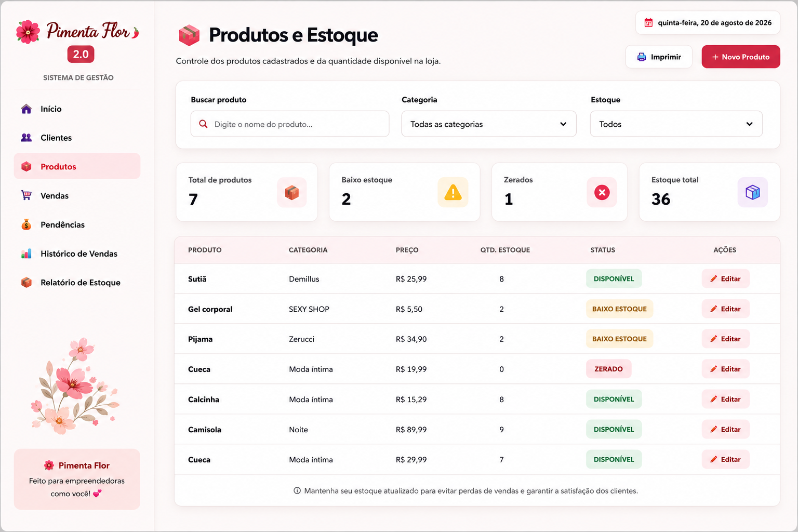
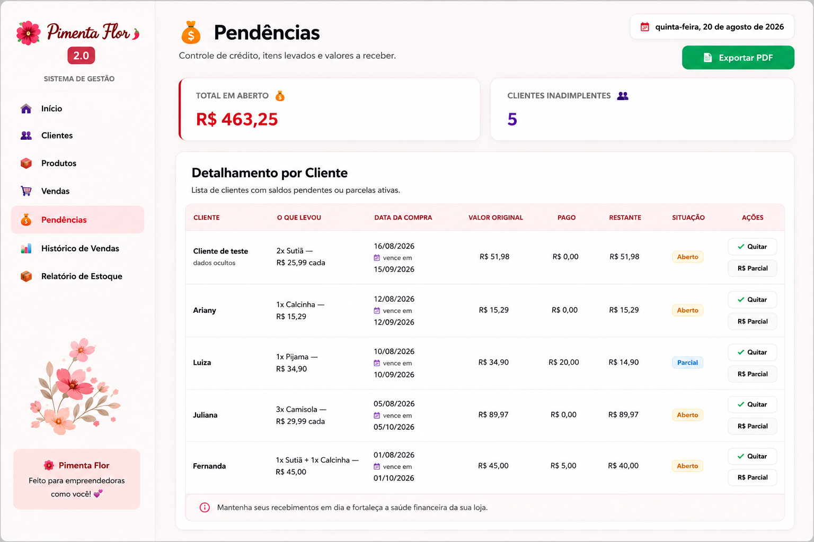
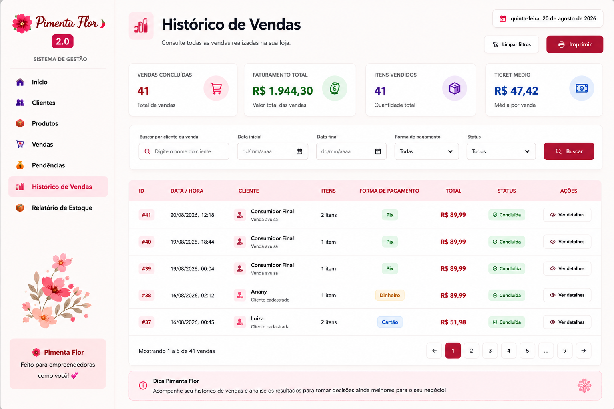
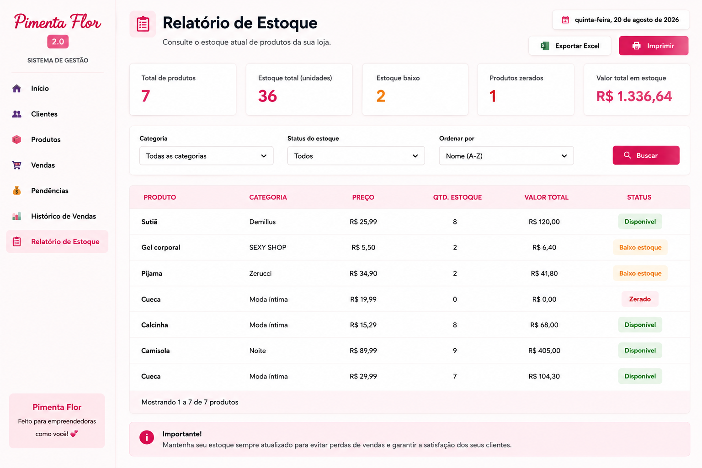

# 🌸 Pimenta Flor 2.0

Sistema de gestão desenvolvido para pequenas empresas, com foco no controle de produtos, clientes, vendas, estoque, pendências financeiras e relatórios.

O projeto foi desenvolvido com o objetivo de centralizar informações importantes do negócio em uma interface moderna, organizada e intuitiva.

---

## ✨ Funcionalidades

- 👥 Cadastro e gerenciamento de clientes
- 📦 Cadastro e controle de produtos
- 📊 Controle de estoque
- 🛒 Registro de vendas
- 💳 Controle de pendências financeiras
- 📜 Histórico completo de vendas
- 📦 Relatório de estoque
- 🔎 Busca e filtros de informações
- 📄 Exportação de relatórios em PDF

---

## 🖥️ Dashboard

Visão geral das principais informações do negócio, incluindo faturamento, vendas, valores a receber e alertas de estoque.

---

## 👥 Gestão de Clientes

Cadastro e gerenciamento de clientes, permitindo organizar informações importantes para o relacionamento e controle comercial.

---

## 📦 Produtos e Estoque

Controle de produtos cadastrados, categorias, preços, quantidade disponível e alertas de estoque.

---

## 💰 Pendências Financeiras

Controle de valores em aberto, clientes inadimplentes e acompanhamento de pagamentos.

---

## 🛒 Histórico de Vendas

Consulta detalhada das vendas realizadas, com filtros por cliente e período.

---

## 📊 Relatório de Estoque

Visualização da posição atual do estoque, quantidade de itens disponíveis e valor total armazenado.

---

## 🛠️ Tecnologias Utilizadas

- Node.js
- Express
- JavaScript
- HTML5
- CSS3
- SQLite

---

## 🎯 Objetivo do Projeto

O Pimenta Flor 2.0 foi desenvolvido como um projeto de sistema de gestão para pequenas empresas, buscando simplificar processos administrativos e centralizar informações importantes como vendas, clientes, produtos, estoque e pendências financeiras.

---

## 🚀 Status do Projeto

🟢 Projeto funcional e em constante evolução.

---

## 📸 Interface

O sistema foi desenvolvido priorizando uma interface limpa, moderna e intuitiva, facilitando a utilização das funcionalidades no dia a dia.
